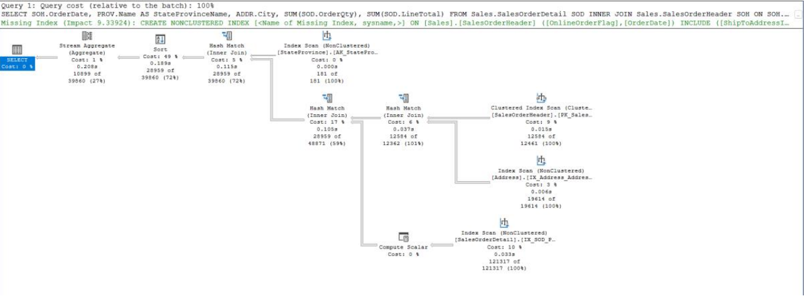
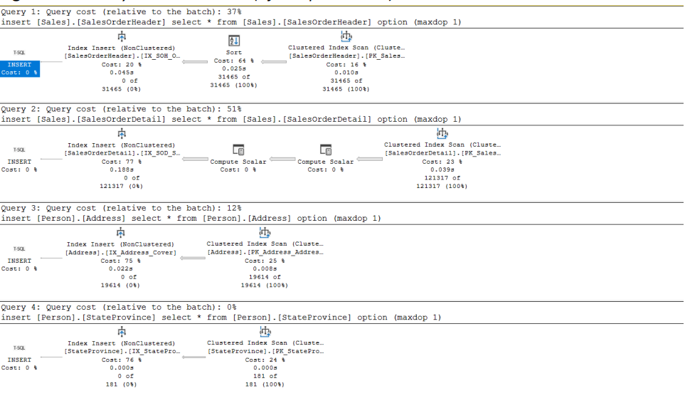
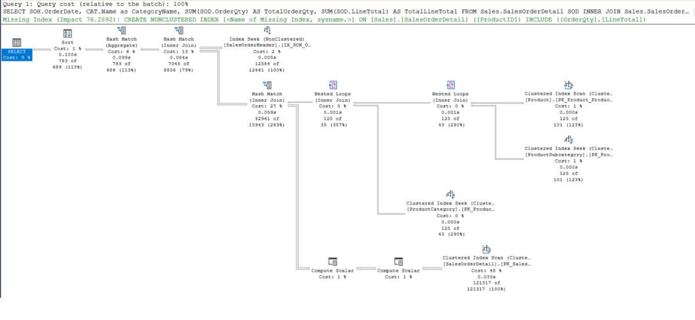
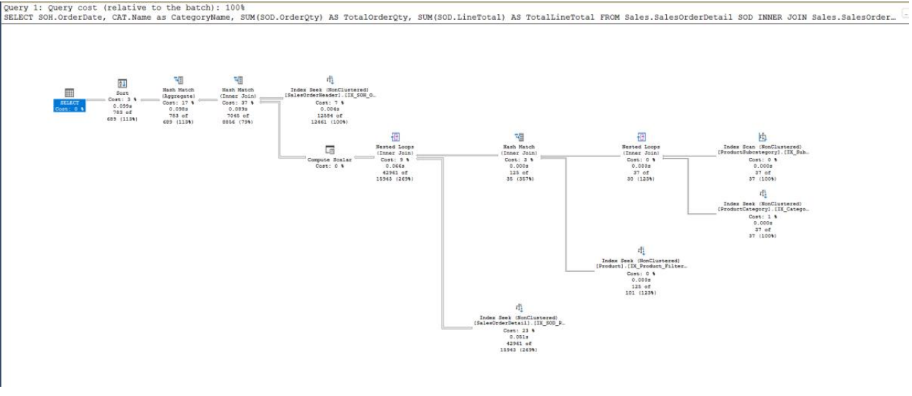
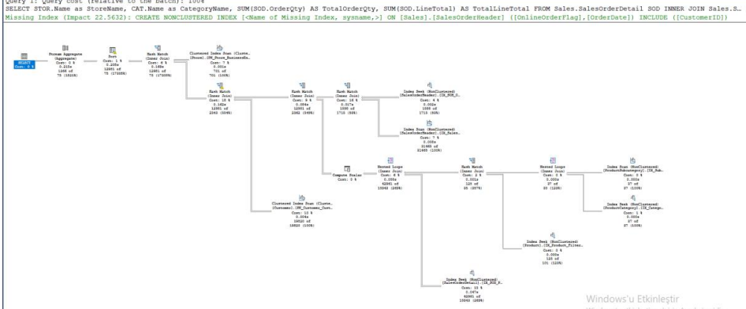
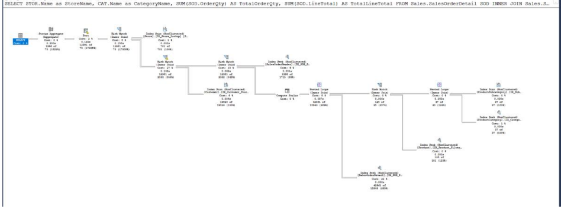

# SQL Query Optimization Case Study (AdventureWorks)

This repository presents a **case study on SQL query optimization**
using the **AdventureWorks** database.

The focus of the project is on:
- Execution plan analysis
- Index design
- Query cost reduction
- Performance comparison before and after optimization

Rather than application development, this work emphasizes
**database performance engineering and analytical thinking**.

---

## 🎯 Project Objective
The objective of this project is to improve the performance of
complex analytical SQL queries by:

- Analyzing execution plans
- Identifying bottlenecks (scans, joins, sorts)
- Applying appropriate indexing strategies
- Comparing performance **before and after optimization**

---

## 🧠 Optimization Methodology
Each query followed the same optimization workflow:

1. Execute the original query
2. Analyze the execution plan
3. Identify performance bottlenecks
4. Apply indexing strategies (composite / covering indexes)
5. Re-execute the query
6. Compare execution plans and relative query costs

---

## 📊 Query 1 – Sales Analysis (Before vs After)

### Before Optimization

Key observations:
- Multiple index scans
- Expensive hash joins
- Missing index recommendations

### After Optimization

Improvements:
- Index seeks replaced scans
- Reduced join and sort costs
- More efficient execution plan structure

---

## 📊 Query 2 – Product & Category Aggregation (Before vs After)

### Before Optimization

Key observations:
- High-cost join operations
- Inefficient access paths
- Suboptimal index usage

### After Optimization

Improvements:
- Improved join strategy
- Reduced query cost
- Cleaner and more predictable execution plan

---

## 📊 Query 3 – Store-Level Sales Analysis (Before vs After)

### Before Optimization

Key observations:
- Heavy aggregation cost
- Execution plan sensitive to data size
- Potential scalability concerns

### After Optimization

Improvements:
- Execution plan became more stable
- Better index utilization
- Demonstrates that optimization is not only about speed,
  but also about **scalability and robustness**

---

## 🛠 Technologies Used
- SQL Server (AdventureWorks)
- SQL (Execution Plan Analysis)
- Index Design & Optimization
- Performance Benchmarking
- Python (used for repeated execution and timing)

---

## 📄 Report
The full technical report, including detailed explanations,
execution plans, and performance measurements, is available here:

`report/sql_query_optimization_report.pdf`
